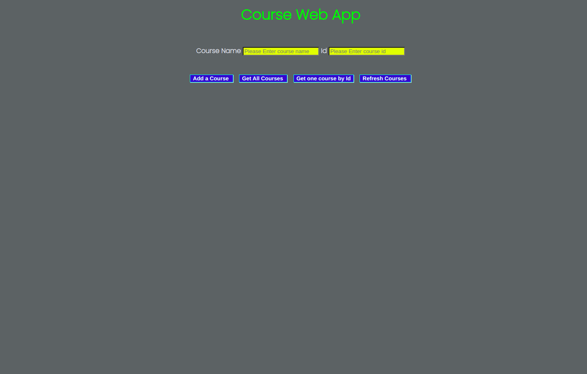

# Courses APP

> A simple full-stack App allow the user to get, add, delete,update a course and get all the courses and refresh them

## Table of contents

- [General info](#general-info)
- [Screenshots](#screenshots)
- [Technologies](#technologies)
- [Setup](#setup)
- [Features](#features)
- [Status](#status)
- [Inspiration](#inspiration)
- [Contact](#contact)

## General info

> A simple full-stack app , the objective is learn top connect the Back-end with the Front-end.

## Screenshots



## Technologies

- Node 14.5.5
- Nodemon 2.0.7
- Express 4.17.1
- VSC code
- JavaScript
- Postman
- Heroku

## Setup

- `npm install`

- `npm run dev`

- use `Postman` to `GET`, `POST` , `PUT` and `DELETE` course(s)

## Code Examples

```js
"use strict";
const controllers = require("./controllers.js");
const express = require("express");

const router = express.Router();

router.get("/", controllers.hello);

//  routes

router.get("/courses", controllers.getAllCourses);
router.get("/courses/:id", controllers.getCourse);
router.post("/courses", controllers.addCourse);
router.put("/courses/:id", controllers.updateCourse);
router.delete("/courses/:id", controllers.deleteCourse);

module.exports = router;
```

## Features

List of features ready and Todos for future development

-
-
-

To-do list:

-
-

## Status

Project is: _in progress_

## Inspiration

How to build a REST API with Node js & Express by [Mosh]

## Contact

By [HYF - Group 3]
